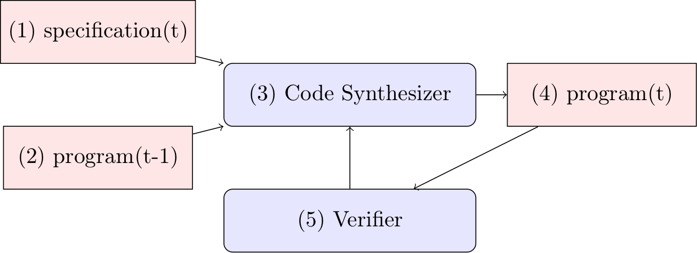

# Program Synthesizer

## Introduction
This is a language model based program synthesizer that can synthesize programs from a given program specification.

## Description
<div align="center">

</div>

A language model based code synthesizer `(3)` is used to synthesize a program iteratively. A specification `(1)` describes the change between the old `(2)` and new program `(4)`. The language model uses the specification and old program to generate the new program. After each step the program is executed by a verifier `(5)`. The verifier checks the program for errors and if there are errors the feedback is used by the language model to generate a new program without errors.

## Example specifications

### "Hello, World!" specification
The folder `specs` contains the file `program-hello.spec` that specifies a simple "Hello, World!" program.

Old program:
```Python
if __name__ == "__main__":
    pass
```

Prompt:
```Python
### Old
if __name__ == "__main__":
    pass
### Specification
Change the old program according to the following specification:
Add a function hello that returns the string "hello, world"
### New
```

New program:
```Python
if __name__ == "__main__":
    pass

def hello():
    return "hello, world"
```

### OpenID connect specification
The folder `specs` contains the file `program-oidc.spec` that specifies a simple OpenID connect client program. The specification for the client is based on the official [OpenID Connect 1.0](https://openid.net/specs/openid-connect-basic-1_0.html) specification.

## Run program synthesis
For running the program synthesizer access to the OpenAI Codex model is required:
```
python main.py
```

## Evaluate
Prepare evaluation
```bash
python main_program_syn_evaluate1.py
```

Run evaluation
```bash
sh sandbox.sh
```

| File | Pass@1 | Date
| --- | --- | --- |
tasks-synthesized.json| 54.88% | 2022-10-23 |

## References

| Paper | Comment |
| --- | --- |
| [Repair Is Nearly Generation: Multilingual Program Repair with LLMs](https://arxiv.org/pdf/2208.11640.pdf) | Prompt for the Auto Debugger was insipired by this paper |